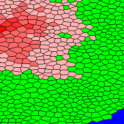
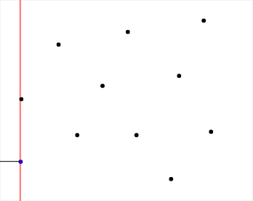
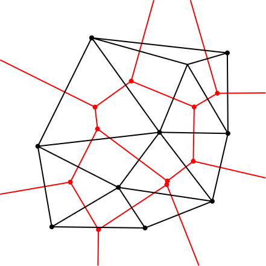
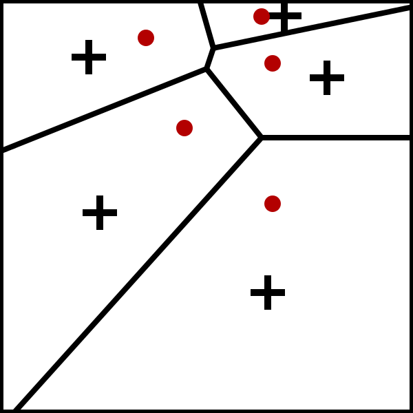
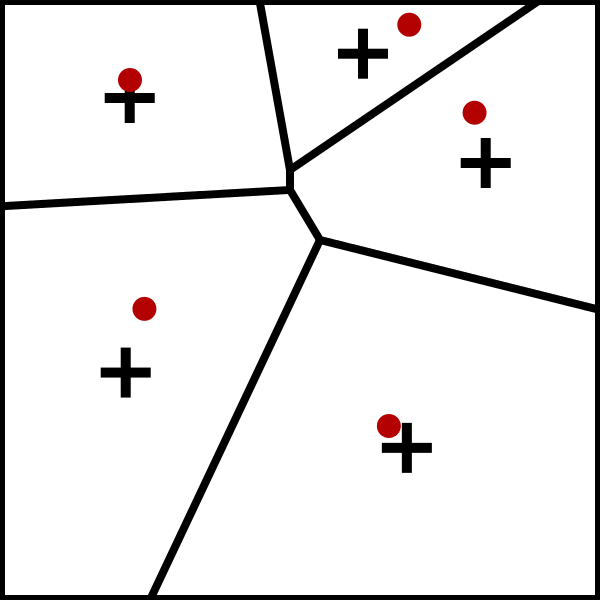
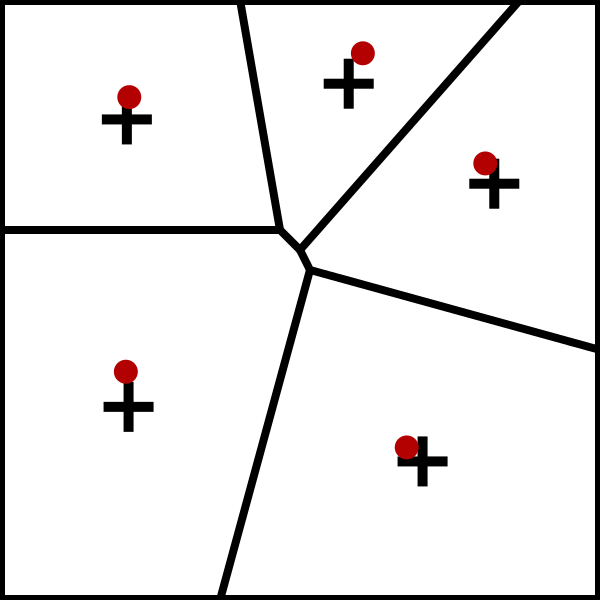
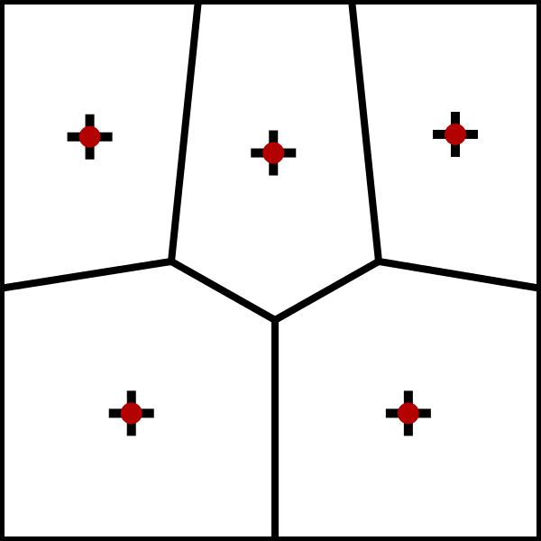

# 2020-COMP3016-Coursework2

## User interaction
The software is all contained inside a exe file. The user interacts with the software 
through the insterface which is made using the DearIMGui library. The interface is pretty
self explanatory and I beleive appropriately labled. On start up the program randomly
generates a new map. The user can generate new maps at the click of a button, Using the program in
Visual studio slows down the program quite a bit but map generation while using the exe file is instant.
The user is also able to edit part of map data such as Nations, Culture and Relgion. Map data can also
be saved and loaded.
## Code explanation
### Final product
So I think its best to show the final product to give context and then break it down.

This screen show a randomly generated map and the cells that make up the land are shown with borders 
### Breaking down generation
To actually start generating height, nations, religion and culture which I'll refer to as map data I need to partition 
2D space and then build upon that.
#### Partitioning 2D space
Voronoi diagrams (VD) are a way of partition space around given points here is an example of a Voronoi diagram
To achieve this I used a Library called MyGal which does three major things Generates a 
VD, generates a Delaunay's triangulation(DL) for the VD and also peforms Lloyds Relaxation(LR) on a VD

Here is an example Voronoi diagram and a Voronoi diagram from my program

<1> 

The actual algorithm that is used by MyGal is fortunes algorithm which is visulised here

<2>

Some useful infomation for a cell would be what cells is it next to well this is what DL is for as VD and DL
are dual graphs which means one can be derived from the other

<3>

The last things that is needed before actual map generation can start is LR which make a VD have more 
regular looking shapes

<4><5><6><7>

Now that all that has been done I can move on to decide what each cells (Voronoi shape) properties should be

#### Height
Height is generated by choosing a random cell and building out height radially until either 
there are no more cells or height hasnt gotten too low. Here is a simplified example

#### Nations, Cultures and Religions
### File handling
#### Reading
#### Writing
### Inspiration
### Comparison to similar software
### Youtube video
### Sources
<1> https://en.wikipedia.org/wiki/File:Euclidean_Voronoi_diagram.svg
<2> https://en.wikipedia.org/wiki/File:Fortunes-algorithm-slowed.gif
<3> https://en.wikipedia.org/wiki/File:Delaunay_Voronoi.svg
<4> https://en.wikipedia.org/wiki/File:LloydsMethod1.svg
<5> https://en.wikipedia.org/wiki/File:LloydsMethod2.svg
<6> https://en.wikipedia.org/wiki/File:LloydsMethod3.svg
<7> https://en.wikipedia.org/wiki/File:LloydsMethod15.svg