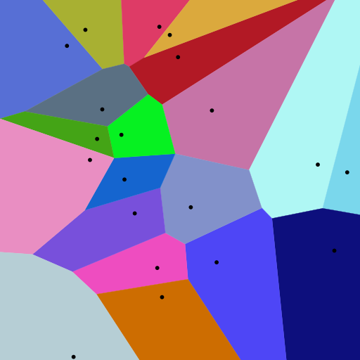

# 2020-COMP3016-Coursework2

## User interaction
The software is all contained inside a exe file. The user interacts with the software 
through the insterface which is made using the DearIMGui library. The interface is pretty
self explanatory and I beleive appropriately labled. On start up the program randomly
generates a new map. The user can generate new maps at the click of a button, Using the program in
Visual studio slows down the program quite a bit but map generation while using the exe file is instant.
The user is also able to edit part of map data such as Nations, Culture and Relgion. Map data can also
be saved and loaded.
## Code explanation
### Final product
So I think its best to show the final product to give context and then break it down.

This screen show a randomly generated map and the cells that make up the land are shown with borders 
### Breaking down generation
To actually start generating height, nations, religion and culture which I'll refer to as map data I need to partition 
2D space and then build upon that.
#### Partitioning 2D space
Voronoi diagrams (VD) are a way of partition space around given points here is an example of a Voronoi diagram
To achieve this I used a Library called MyGal which does three major things Generates a 
VD, generates a Delaunay's triangulation(DL) for the VD and also peforms Lloyds Relaxation(LR) on a VD

Here is an example Voronoi diagram and a Voronoi diagram from my program

<1> 

The actual algorithm that is used by MyGal is fortunes algorithm which is visulised here

<2>

Some useful infomation for a cell would be what cells is it next to well this is what DL is for as VD and DL
are dual graphs which means one can be derived from the other

<3>

The last things that is needed before actual map generation can start is LR which make a VD have more 
regular looking shapes

<4><5><6><7>

Now that all that has been done I can move on to decide what each cells (Voronoi shape) properties should be

#### Height
Height is generated by choosing a random cell and building out height radially until either 
there are no more cells or height hasnt gotten too low. Here is a simplified example

Here you can small island that was generated this way. Red indicating a higher
height and green a lower height.

#### Nations, Cultures and Religions
Nations, Cultures and Religions (NCR) are all generated in the same way and is
very similar to height the only diffence being there are usually multiple NCR's generating 
at a time where with height each island is generated on its own.

Here is a simplified example example

And here it is in program

### File handling
#### Reading
Reading file is very simple every line is either has data that is needed or not.
If it has data that is need then the data is retrieved and it moves onto the next line

#### Writing
Writing Files is another simple process 

#### Backend Systems
Out the backend of the program is a statemachine which handles which 
state the program is in. A state in this context has a Init, HandleInput, Update and Draw
function Init is called once while the rest are called each frame this basically 
is each part of a program for example in a simple game you would have a main menu state
and game state. The state machine was used during development but became redundant 
towards the end when I combined everthing into one as it would not be necessary to seperate part
of this program. But it would make expansion easier in the future so I left it in.

#### How it all fits together
The only state the program has is a MapState class which handles everthing the user
interacts with and sees. This class has a WorldManager object. The WorldManager class
contains all the map data (Cells,Nations,Religions and Cultures) their are two function
that the MapState could call to change the map these are Generate and LoadFromFile. MapState 
can also edit cell properties using the WorldManager. The last major function of WorldManager 
is SaveMap which as you can probably guess writes all map data to a file. WorldManager in turn has 
a WorldGenerator object and Reader object which im sure you can guess what each of them do.

So a brief walkthrough of startup
1)MapState is initialised
2)MapState ask WorldManager to Generate map data
3)WorldManager asks WorldGenerator generate map data
4)A random set of points is generated
5)A VD is generated
6)LR is applied and DT is calcualted this makes up the Cells
7)Height is generated and cells either become land or ocean
8)NCR are generated on cells that are land
9)This is all passed back to WorldManager
10)Cell Coords are bufferd 
11)Each state has a HandleInput, Update and Draw function which are called every frame

### Inspiration
A lot of inspiration was drawn from https://azgaar.github.io/Fantasy-Map-Generator the creator 
of this has a write up of their project here https://azgaar.wordpress.com/. This helped
me with the methods of map generation but all code was written by me apart from 
the libraries obviously.
### Comparison to similar software
A world generation tool can become a complex program so my project lacks many 
features that others have. But I did not deem it necessary or probably possible to 
include in this prototype
### Conclusion and known problems
There are some problems with my program such copy and paste do now work which makes loading files bothersome.
You can not name and NCR this would be a simple thing to add I would just need to add a string to every NCR Struct.
However I wanted every name to be randomly generated aswell which made it more complicated so I added it to my list 
of things to do and never got round to it.
Having NCR being able to spread over water can make them look weird however if they cant some islands do not get any NCR
I settled for not letting them spread over water but this can leave those island looking weird.
### Youtube video
https://youtu.be/kbRQe6pElR8
### Sources
<1> https://en.wikipedia.org/wiki/File:Euclidean_Voronoi_diagram.svg

<2> https://en.wikipedia.org/wiki/File:Fortunes-algorithm-slowed.gif

<3> https://en.wikipedia.org/wiki/File:Delaunay_Voronoi.svg

<4> https://en.wikipedia.org/wiki/File:LloydsMethod1.svg

<5> https://en.wikipedia.org/wiki/File:LloydsMethod2.svg

<6> https://en.wikipedia.org/wiki/File:LloydsMethod3.svg

<7> https://en.wikipedia.org/wiki/File:LloydsMethod15.svg
